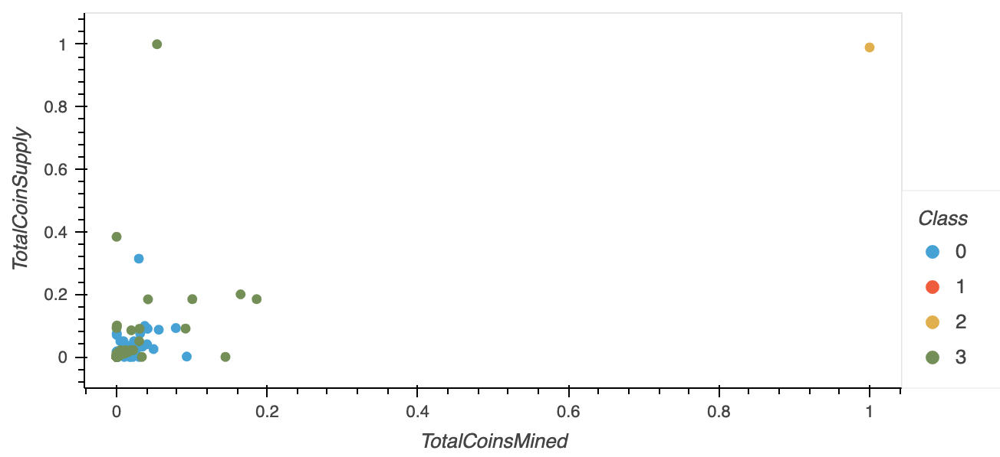

# Cryptocurrencies

## Overview
For this project, I used unsupervised machine learning to cluster different cryptocurrencies in order to be able to create portfolios of tradeable currencies to offer customers of Accountability Accounting. In order to be able to identify these clusters, I had to take a few steps.
1. Clean up the data using pre-processing to make the data usable
2. Reduce the amount of features using PCA so that each feature is weighted appropriately
3. Use the K-means model to identify the number of clusters needed
4. Create the visualizations that display how these clusters are grouped

## Results

From the scatter plot, we can see that there are 4 different clusters of cryptocurrencies based on the total coins that have been mined and the total supply of coins. We can see 2 very prominent clusters (0 & 3) and 2 with very few plots (1 & 2).  Since we are unable to display the 3D model, you cannot see the plots of Class 1 because they fall within classes 0 and 3. 